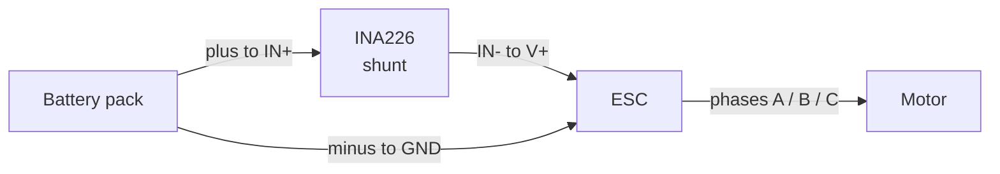
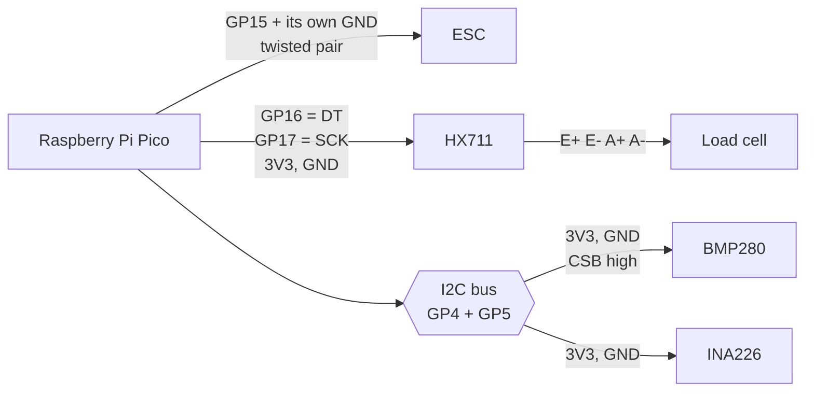

# Hardware setup

Everything needed to build a stand this firmware will run on. Nothing here is
exotic: the whole bill of materials is common hobby parts. But several of the
connections fail in ways that look like a dead component, so read the gotchas.

## Bill of materials

| part | notes |
|---|---|
| RP2040 board | Raspberry Pi Pico or any RP2040 board. Two cores and PIO are both required. |
| Load cell | Strain-gauge beam cell sized for your thrust range. A 100 g to 500 g cell suits whoop-class motors; a 5 kg cell wastes almost all its resolution on nothing. |
| Load cell ADC | **HX711** (24-bit, 80 SPS) or **NAU7802** (24-bit, up to 320 SPS, I²C). Pick one and set `LOADCELL_NAU7802` in `config.h`. On an HX711 get a board where the `RATE` pin is accessible, because we want the 80 SPS high rate. The NAU7802 costs more but repays it twice over: 4× the rate, and a working internal regulator (see the gotcha below). |
| INA226 breakout | **Check the shunt before buying.** Most ship with R100, which caps you at 0.8 A. You want at most R010. See the gotcha below. INA219/INA23x also work; set the values in `config.h`. |
| BMP280 breakout | Ambient temperature and pressure; humidity is not measured, though a BME280 would add it (see [Possible future upgrades](#possible-future-upgrades)). Optional but strongly recommended (see below). |
| ESC | Any ESC supporting **bidirectional DShot**, so telemetry returns over the signal wire, so no separate telemetry pad is needed. Reference build: an **AM32 1–2S 20 A** on an AT32F421, running **AM32 2.21**. An **XSD 7A 1–2S** on **Bluejay v0.21.0** was used before it, and most of the ESC-specific findings in this repository were measured on that one. |
| Motor + prop | The thing under test. |
| Bench supply | Optional, but it makes `KV` mode possible and keeps voltage constant across a sweep. |
| Calibration masses | Several known weights spanning your thrust range. Accuracy here sets the accuracy of everything. |

## Wiring

There are two separate circuits here, and keeping them straight is most of the
job: a **power path** carrying motor current, and a set of **signal
connections** from the Pico. They meet at exactly one place: ground.

All Pico pin numbers are **GPIO numbers, not header positions**: GP15 is
physical pin 20 on a Pico. Change any of them in `firmware/config.h`.

### 1. Power path

Battery to ESC, with the INA226's shunt in series so that all motor current
flows through it. The motor's three phase wires go to the ESC's motor pads and
are not part of this loop.



**Put the shunt in the positive lead, not the negative one.** Both measure the
same current. But a shunt in the ground return leaves the ESC's ground sitting
up to 80 mV away from battery ground at full current. That is the reference your
DShot signal is measured against. High-side keeps every ground in the system at
the same potential.

Use wire sized for the current, and keep this loop short. Nothing else connects
to it.

**Then measure what that run actually costs you, because it lands inside every
efficiency figure.** The host records power as the INA's bus voltage times its
current. Any resistance between the INA's sense point and the ESC therefore
burns watts that get counted as input power but never reach the motor. It fails
silently:
the curves stay smooth and plausible, they are just all wrong by the same
factor.

Checking it takes five minutes and needs no special instrument:

1. Disconnect the supply from the stand, and instead clip it across the two ends
   of the positive run. Supply + goes at the INA's input, supply − at the ESC's
   V+ pad. That path is now the load; nothing else forms a loop.
2. Set roughly 1 V with a 1 A limit. **Read the current the supply actually
   reports** rather than assuming it reached the limit. Clip-lead resistance
   often keeps it in constant-voltage mode well below it.
3. Measure the voltage drop across the run with a multimeter on millivolts,
   probing at separate points from the injection clips. That makes it a four-wire
   measurement, so clip and lead resistance drop out. Millivolts divided by the
   reported amps gives the resistance directly.

Aim for **under ~20 mΩ**. Above that, suspect terminations before cable, and
compare against the negative return, which should be similar. Remember too that
copper-clad aluminium wire creeps and oxidises inside a crimp or under a screw,
so it degrades over time in exactly this way.

If your INA226 exposes the VBUS pins you can also **sense the bus voltage at the
ESC end** rather than at the INA. It costs nothing at build time and makes the
recorded voltage the one the ESC actually gets.

### 2. Signal connections

Everything below is low-current and runs from the Pico. Power all three
breakouts from the Pico's `3V3` pin. The Pico's I²C and GPIO are 3.3 V logic,
so running a sensor at 5 V risks its outputs sitting above what the RP2040
wants to see.



Pin by pin:

| device | device pin | connects to |
|---|---|---|
| **ESC** | signal | Pico `GP15` |
| | ground | Pico `GND`, its own wire; see below |
| **HX711** | `DT` | Pico `GP16` |
| | `SCK` | Pico `GP17` |
| | `VCC` | Pico `3V3` |
| | `GND` | Pico `GND` |
| | `RATE` | `3V3`; see gotchas, this one matters |
| **NAU7802** *(instead of the HX711)* | `SDA` | Pico `GP4` |
| | `SCL` | Pico `GP5` |
| | `DRDY` | Pico `GP16`; wire it, see below |
| | `VIN` | Pico `3V3`, not 5 V |
| | `GND` | Pico `GND` |
| **INA226** | `SDA` | Pico `GP4` |
| | `SCL` | Pico `GP5` |
| | `VCC` | Pico `3V3` |
| | `GND` | Pico `GND` |
| | `IN+` / `IN−` | the power path above |
| **BMP280** | `SDA` | Pico `GP4` |
| | `SCL` | Pico `GP5` |
| | `VCC` | Pico `3V3` |
| | `GND` | Pico `GND` |
| | `CSB` | `3V3`; see gotchas, this one matters. 4-pin I²C-only boards tie it already |
| | `SDO` | `GND` or `3V3`, picking address 0x76 or 0x77 |
| **load cell** | 4 wires | HX711 `E+` `E−` `A+` `A−` |

The INA226 and BMP280 share the one I²C bus, so `SDA` and `SCL` each fan out to
both. Their addresses differ, so nothing needs configuring: `measure.py
--check` scans the bus and reports what answered.

Load cell wires are commonly red `E+`, black `E−`, green `A+`, white `A−`, but
this varies by manufacturer; check yours. Swapping `A+` and `A−` simply inverts
the sign, which calibration then absorbs, so it is not a fault. Just declare
the geometry you end up with (see [CALIBRATION.md](CALIBRATION.md)).

The HX711 excites the load cell from its own supply, so **the counts per gram
depend on what you power it from.** Pick 3.3 V or 5 V and stay with it; if you
change it later, recalibrate.

### 3. Grounding, the part that bites

Power the Pico from USB; that is also your data link. Power the ESC from the
pack. **The two grounds must be connected**, or the DShot signal has no
reference and the ESC sees noise instead of a command.

Run the **ESC's signal ground as its own wire** back to a Pico `GND`, twisted
together with the GP15 signal wire. Do not let the DShot signal use the
high-current battery return as its ground path. Several amps of switching
current through a shared return becomes tens of millivolts of offset between
ESC ground and Pico ground. That moves the logic threshold exactly when the
motor is running and the signal matters most.

The distinction is which path the signal's return current takes:


The heavy line carries motor current. **The two dotted wires between the Pico
and the ESC are the twisted pair**: signal out, its own ground back. They carry
almost no current, and because they run together, noise coupling into one
couples into the other and largely cancels.

Sharing a single ground wire between both roles is the mistake: the signal's
reference then moves with every amp the motor draws.

Keep that pair away from the three motor phase wires, which carry the switching
edges. Crossing at right angles is fine; running alongside them is not.

## Gotchas

These are the ones that cost real time.

**BMP280 `CSB` must be tied high** to select I²C mode. Left floating, the part
stays in SPI mode and presents *exactly* like a dead sensor. `SDO` tied low or
high selects address 0x76 or 0x77; the firmware probes both. The INA226
answering on the same bus is not evidence the BMP280 is wired correctly. They
are separate parts. `measure.py --check` scans the bus and tells you what
actually answered.

**Most INA226 breakouts come with the wrong shunt.** The common ones ship with
**R100** (100 mΩ), and the INA226's shunt input is fixed at ±81.92 mV, so:

| shunt | full scale |
|---|---|
| R100 (100 mΩ), the usual default | **0.819 A** |
| R050 (50 mΩ) | 1.64 A |
| **R010 (10 mΩ), what you want** | **8.19 A** |
| R005 (5 mΩ) | 16.4 A |

0.8 A is not enough for anything with a propeller on it. A whoop-class motor
draws around 4 A steady and several amps starting, so an R100 board clips
everything above roughly a quarter throttle.

The failure is silent, which is what makes it worth checking twice. Current
simply stops rising, efficiency curves stay smooth and plausible, and nothing in
the data says the channel is pinned. The firmware does flag saturation per
sample once `INA_SHUNT_FS_UV` is set correctly, but only if you told it the
truth about the shunt.

The shunt is the large 2512-size resistor on the breakout, marked `R100` or
`R010`. Buy the R010 version, or desolder and replace it. Then set
`INA_SHUNT_UOHM` in `config.h` to match what is actually fitted, and
`INA_MAX_AMPS` at or just below the resulting ceiling.

You can see what it looks like without any hardware:

```bash
python tools/fake_stand.py -m SWEEP --shunt-uohm 100000
```

**HX711 `RATE` must be tied high for 80 SPS.** Floating or low gives 10 SPS,
which is too slow to resolve a spin-up and will make thrust constantly flag
stale. Set `HX711_SPS` in `config.h` to match what you wired.

**An HX711 run from 3.3 V is out of its own spec.** The chip generates its
analog supply on-chip from a 1.25 V bandgap and the board's feedback divider.
The common green modules target ~4.3 V (R1 = 20 kΩ, R2 = 8.2 kΩ), which a 3.3 V
supply cannot reach, so the regulator saturates and AVDD simply follows your
supply rail, with no rejection of anything on it. Measure `E+` to `E−`: ~4.3 V
means it is regulating, ~3.2 V means it is not.

The chip is ratiometric, so this barely affects counts per gram. It does affect
the noise floor, short-term wander and the zero's thermal sensitivity. Three
ways out, in increasing order of effort: power the module from 5 V (needs level
shifting, the RP2040 is not 5 V tolerant), refit the divider for ~2.7 V
(R1 = 22 kΩ, R2 = 20 kΩ), or fit a **NAU7802**, whose internal LDO is set in
firmware and regulates properly from 3.3 V.

**Twist the load cell pairs by circuit loop:** `E+` with `E−`, and `A+` with
`A−`.

Three things matter more than the twist, though:

- **Shielding.** The ESC switches several amps at tens of kilohertz, which
  couples capacitively, and twisting does nothing against that. If your cell
  cable has a shield, ground it at the **amplifier end only**.
- **Routing.** Keep the cable short and away from the motor phase wires.
- **Strain relief.** Twisting stiffens a cable, and a stiff cable pulls on the
  beam. Leave a service loop and anchor it to the frame, not the moving side.
  On a small cell this shows up as zero drift and hysteresis, the very things
  you are trying to measure away.

Do not cut and re-terminate the cell's own cable if you can avoid it. On a
4-wire cell there are no sense leads, so lead resistance sits in series with
the excitation and forms part of your counts-per-gram.

**Wire the NAU7802's `DRDY` pin.** Without it the firmware has to ask the chip
over I²C whether a conversion is ready, once per conversion period, on the bus
the INA226 and BMP280 share. A GPIO read costs nothing. Set `NAU7802_DRDY_PIN`
to `-1` only if your breakout does not bring the pin out.

**Changing the load cell ADC means a fresh MASSCHECK.** The two parts have
different gain paths, so counts per gram changes and the sign may flip with the
wiring. The factor lives host-side in `stand.json`, so this is a calibration
run rather than a reflash; see [CALIBRATION.md](CALIBRATION.md).

**The ESC must be in bidirectional DShot mode.** Standard DShot sends no
telemetry back, so you get no RPM at all. On BLHeli_S/Bluejay this is the
"bidirectional DShot" option, set from a flight controller's ESC configurator.
Without it, `measure.py --check` shows zero frames decoded, and specifically
`silent` rather than `corrupt`, which distinguishes it from a wiring fault.

**Reaching the ESC's own firmware depends on which ESC it is.** On BLHeli_S and
Bluejay it is out of scope: those run on a SiLabs EFM8, and this stand has no
route to that bootloader. Flash and configure them from a flight controller.

ARM-based ESCs (AM32, BLHeli_32) speak the 4-Way protocol over the same signal
wire the stand already drives, so the board can reach them directly. That is
wired up. Flash `vendor/BlHeli-Passthrough/rp2040/` in place of `firmware/` and
the board presents itself to a configurator as if it were a flight controller;
`tools/flash_board.py` does each swap in one command. `tools/am32.py` then reads
the settings page, changes named fields and flashes the ESC without a
configurator at all.

**That matters for more than convenience.** `esc_firmware` in `stand.json` is a
value you declare, because nothing in bidirectional DShot carries a firmware
version, and a stale declaration is written into every CSV and looks right
forever. On an ARM ESC it can be read back and checked instead. It is also the
only way to see settings that decide whether a measurement means anything: a
brake that turns a `COASTDOWN` into a measurement of the brake, a switching
frequency that moves with throttle, or a duty ceiling that flattens the top of
a sweep while throttle keeps rising.

**Do not fit an external pull-up on the DShot line.** The line idles high and
the ESC pulls it low, so *if* you fitted one it would have to be a pull-**up**.
But the RP2040 internal pull-up is already enabled by the DShot library, and it
is sufficient. A resistor small enough that the RP2040 cannot pull the line low
means the ESC never sees valid DShot and never answers at all.

**Mount the load cell so it measures along the thrust axis.** A cell loaded
off-axis reads differently, and the calibration you derive with weights will not
apply to thrust. Whether thrust loads or unloads the cell is a property of your
mounting and gets declared during calibration; see [CALIBRATION.md](CALIBRATION.md).
There is no calibration constant to set before first boot: the firmware reports
raw counts and the host derives the factor from known masses.

## Possible future upgrades

Alternatives considered but not yet built or tested; the firmware and host assume
the build above.

- **BME280 for humidity.** The BMP280 measures temperature and pressure only; a
  BME280 is a drop-in swap that adds humidity. The gain is minor: over any
  realistic indoor range humidity moves air density only ~0.35%, against ~2% for
  a few degrees of temperature and ~3% for ordinary weather.
- **A higher-current or faster ESC.** The reference XSD 7A caps speed at roughly
  81 kRPM and current at 7 A, which sets the fastest motor and largest prop the
  stand can test.
- **MLX90640 thermal imager.** Aimed at the motor bell it would show heat
  soaking directly and could log temperatures with the telemetry.

## Verifying the build

Before spinning anything:

```bash
python measure.py --check
```

You should see the boot banner with your `config.h` values, both I²C devices
answering, live samples with thrust near zero, and an ambient reading. Then:

```bash
python measure.py --check --tare --watch 180
```

Three minutes of zero-drift measurement plus telemetry link statistics with the
motor stopped. What to look for:

- **`decoded` near 100%.** If `silent` dominates, the ESC is not answering, so
  check bidirectional DShot is enabled, and check the signal wiring. If
  `corrupt` dominates, the ESC is answering and the answer is arriving damaged.
  That one is electrical: grounding, twist, routing, length.
- **Zero trend under ~0.1 g projected over a session.** A creeping zero is a
  mounting problem, and no calibration corrects it.
- **`EDT frames` non-zero**, if you want the ESC's own telemetry at all. It is
  off unless you pass `--edt`; without that the line reads `not requested`, which
  is a setting rather than a fault. Asked for and still zero means the ESC does
  not support it or has stopped sending.

## Safety

Propellers on a test stand are still propellers.

- Clamp the stand to something solid. Thrust is small, but a stand that skitters
  will take the wires with it.
- Keep clear of the disk, and give it a shield if you can.
- `PING` arms a firmware watchdog: once armed, the motor stops if the host goes
  silent for one second, so a crashed script cannot leave a prop spinning. The
  host also zeroes throttle in a `finally`. **Keep both guarantees in any code
  you add.**
- The watchdog deliberately does not arm until the first `PING`, so a plain
  serial monitor is not fought.
